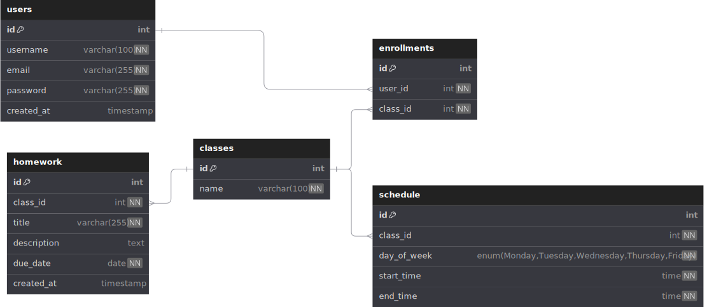

<h1 align="center">HW2</h1>


[NetSchool-PTHS](https://github.com/npanuhin/NetSchool-PTHS) is a real-world school electronic diary system developed as part of my 11th-grade graduation project. The database is designed to manage students’ academic data, classes, homework assignments, and student performance tracking.

[Online Playground](https://dbdiagram.io/d/67d6ce4875d75cc84440856b)



```sql
Table users {
  id          int [primary key, increment]
  username    varchar(100) [unique, not null]
  email       varchar(255) [unique, not null]
  password    varchar(255) [not null]
  created_at  timestamp [default: `now()`]
}

Table classes {
  id          int [primary key, increment]
  name        varchar(100) [not null, unique]
}

Table enrollments {
  id       int [primary key, increment]
  user_id  int [not null, ref: > users.id]
  class_id int [not null, ref: > classes.id]
}

Table schedule {
  id          int [primary key, increment]
  class_id    int [not null, ref: > classes.id]
  day_of_week enum('Monday', 'Tuesday', 'Wednesday', 'Thursday', 'Friday') [not null]
  start_time  time [not null]
  end_time    time [not null]
}

Table homework {
  id          int [primary key, increment]
  class_id    int [not null, ref: > classes.id]
  title       varchar(255) [not null]
  description text
  due_date    date [not null]
  created_at  timestamp [default: `now()`]
}
```
