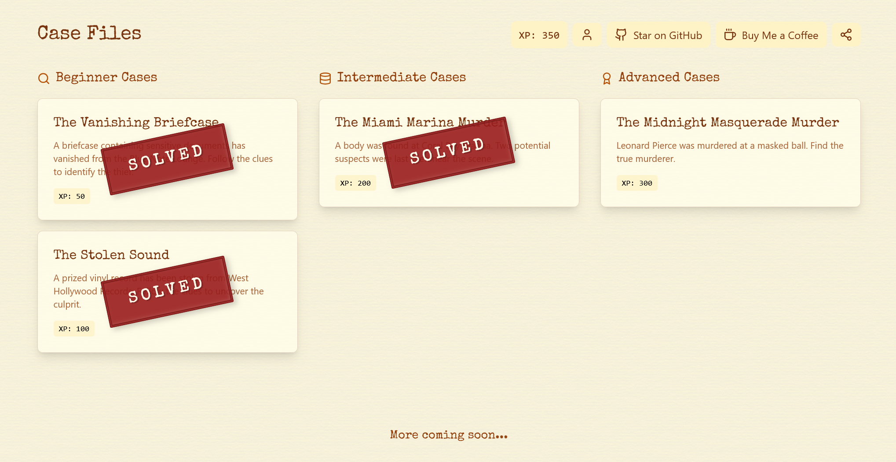

<h1 align="center">HW4 (SQL Noir game)</h1>




## Case #001: The Vanishing Briefcase
```sql
SELECT description
FROM crime_scene
WHERE location = 'Blue Note Lounge'

SELECT suspect_id
FROM suspects
WHERE
  attire = 'trench coat' AND
  scar = 'left cheek'

SELECT *
FROM interviews
WHERE suspect_id IN (3, 183)

SELECT name
FROM suspects
WHERE id = 183
```

## Case #002: The Stolen Sound
```sql
SELECT id
FROM crime_scene
WHERE date = 19830715

SELECT *
FROM witnesses
WHERE crime_scene_id = 65

SELECT id
FROM suspects
WHERE
  bandana_color = 'red' AND
  accessory = 'gold watch'

SELECT *
FROM interviews
WHERE suspect_id IN (35, 44, 97)

SELECT name
FROM suspects
WHERE id = 97
```

## Case #003: The Miami Marina Murder
```sql
SELECT *
FROM crime_scene
WHERE
  date = 19860814 AND
  location = 'Coral Bay Marina'

SELECT *
FROM person
WHERE
  (address LIKE '3__ Ocean Drive') OR
  (name LIKE '%ul %' AND name LIKE '%ez')

SELECT *
FROM interviews
WHERE person_id = 101 OR person_id = 102

SELECT *
FROM surveillance_records
WHERE
  hotel_checkin_id IN (
    SELECT id
    FROM hotel_checkins
    WHERE
      check_in_date = 29860813 OR
      hotel_name LIKE '%Sunset%'
  ) AND
  suspicious_activity IS NOT NULL

SELECT name
FROM person
WHERE id = 8
```
