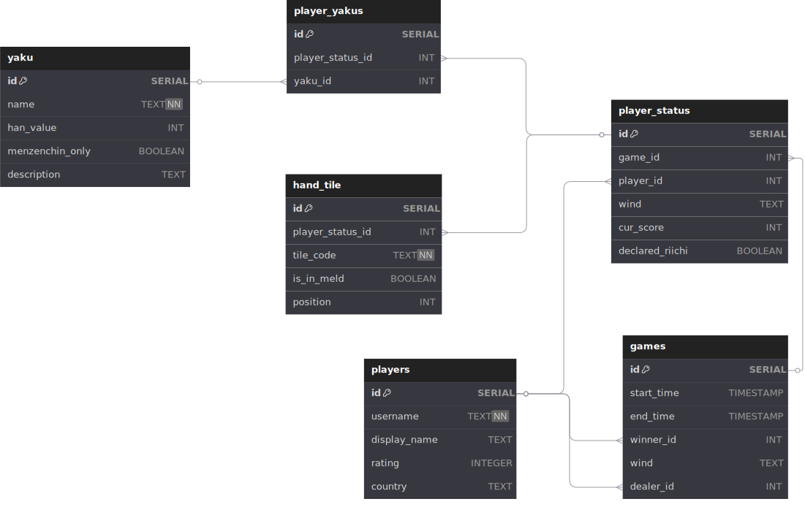

<h1 align="center"><a href="https://en.wikipedia.org/wiki/Japanese_mahjong">Riichi</a> <a href="https://en.wikipedia.org/wiki/Mahjong">Mahjong</a> game tracking and analytics</h1>

My database models competitive Riichi Mahjong games. It tracks key gameplay elements such as players, games, player hands, tile compositions, and scoring patterns known as "[Yaku](https://en.wikipedia.org/wiki/Japanese_mahjong_yaku)".

Each game involves four players, each occupying a seat with a wind direction (`East`, `South`, `West`, `North`). Players start with a score (typically `25'000` points), which changes over the course of the game. Each player maintains a hand of 13 tiles, with a 14th tile drawn to complete the hand when declaring a win. Some tiles may be part of melds — groups of revealed tiles.

Specific tile combinations (Yaku) are used to evaluate whether a player's hand is valid and how much it scores. Each Yaku has an associated "Han" value, and some can only be achieved with closed hands (no melds). The game also has a "Riichi" mechanic, which allows a player to pay a bounty of 1000 points and declare, that they're ready to win, only if their hand is closed.

This project is inspired by the existing system called [Pantheon](https://riichimahjong.org/en) and aims to fully replicate it.

### Scenarios:
- Recording a new game and its participants, including scores and outcomes
- Tracking each player's hand and declared Riichi
- Storing which Yaku combinations were achieved by players during a game
- Efficient querying of past game results, player histories, or specific hand patterns

### Entities:
- `players` — registered users with a rating, username, and optional country
- `games` — individual Mahjong matches with time data, wind round, and winner/dealer references
- `yaku` — valid winning hand patterns, each with name, score value (han), and restrictions
- `tiles` — definitions of Mahjong tiles (e.g., `1m`, `5p`, `0s`, `E`, `C`)

Meta-entities:
- `player_status` — each player's state in a game — wind, score, Riichi status, etc.
- `player_yaku` — maps which player_status earned which yaku in a game
- `hand_tile` — maps which tiles are in each player's hand, their position, and meld status

### Database overview:

Data integrity is enforced through foreign keys, constraints (e.g., tile position validity for non-melded tiles), and unique indexes (e.g., one tile per position in a closed hand). Indexes are optimized for efficient querying of player records, hands, and scoring combinations.
